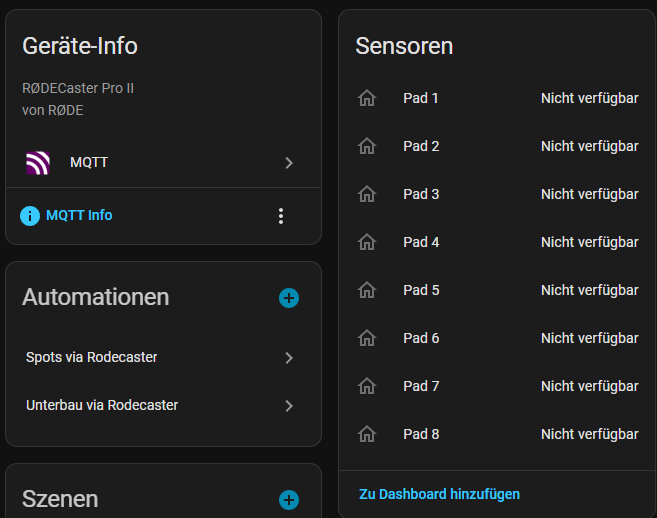
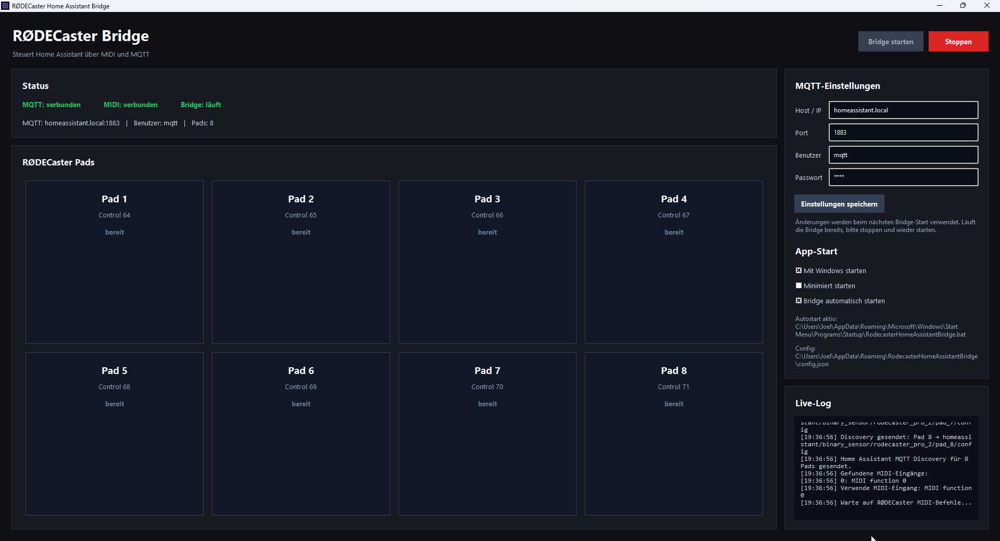

# RØDECaster Home Assistant Bridge

Eine Windows-App, mit der du die SMART Pads deines **RØDECaster Pro II** per MIDI mit **Home Assistant** verbinden kannst.
Die App empfängt MIDI-Befehle vom RØDECaster und sendet passende MQTT-Nachrichten an Home Assistant.

## Features

* Steuerung von Home-Assistant-Geräten über RØDECaster SMART Pads
* Unterstützung für 8 Pads
* MQTT-Anbindung
* Home Assistant MQTT Discovery
* Grafische Windows-Oberfläche
* Einstellbare MQTT-IP, Benutzername und Passwort
* Windows-Autostart
* Option zum minimierten Start
* Minimieren in den Windows-Infobereich
* Windows-Benachrichtigung beim Minimieren
* Live-Log in der App
* Klickbarer Copyright-Link

## Unterstützte MIDI-Controls

Standardmäßig werden folgende MIDI-Control-Change-Werte verwendet:

| Pad   | MIDI Control | MQTT Topic         |
| ----- | -----------: | ------------------ |
| Pad 1 |           64 | `rodecaster/pad/1` |
| Pad 2 |           65 | `rodecaster/pad/2` |
| Pad 3 |           66 | `rodecaster/pad/3` |
| Pad 4 |           67 | `rodecaster/pad/4` |
| Pad 5 |           68 | `rodecaster/pad/5` |
| Pad 6 |           69 | `rodecaster/pad/6` |
| Pad 7 |           70 | `rodecaster/pad/7` |
| Pad 8 |           71 | `rodecaster/pad/8` |

Beim Drücken wird `pressed` gesendet.
Beim Loslassen wird `released` gesendet.

## Voraussetzungen

* Windows 10 oder Windows 11
* Python 3.12
* RØDECaster Pro II
* Home Assistant
* MQTT-Broker, z. B. Mosquitto
* Aktivierte MQTT-Integration in Home Assistant

## Installation

Python 3.12 installieren:

```powershell
winget install -e --id Python.Python.3.12
```

Benötigte Pakete installieren:

```powershell
py -3.12 -m pip install mido python-rtmidi paho-mqtt pystray pillow winotify pyinstaller
```

## Starten der App

```powershell
py -3.12 rodecaster_mqtt_ui_8pads_maximized_github.py
```

## EXE bauen

```powershell
py -3.12 -m PyInstaller --onefile --windowed --hidden-import=rtmidi --hidden-import=mido.backends.rtmidi --hidden-import=pystray._win32 --hidden-import=PIL._tkinter_finder --hidden-import=winotify rodecaster_mqtt_ui_8pads_maximized_github.py
```

Die fertige `.exe` befindet sich danach im Ordner:

```text
dist/
```

## Home Assistant Einrichtung

In Home Assistant muss ein MQTT-Broker eingerichtet sein.

Empfohlen:

1. Mosquitto Broker Add-on installieren
2. MQTT-Integration aktivieren
3. App starten
4. Die App sendet automatisch MQTT Discovery-Daten
5. In Home Assistant erscheint ein Gerät namens:

```text
RØDECaster Pro II
```

Darin werden die Pads als Entities angelegt.

## Beispiel-Automation

```yaml
alias: RØDECaster Pad 1 Licht umschalten
mode: single

trigger:
  - platform: mqtt
    topic: rodecaster/pad/1
    payload: "pressed"

action:
  - service: light.toggle
    target:
      entity_id: light.studio
```

## App-Einstellungen

Die App speichert Einstellungen automatisch unter:

```text
%APPDATA%\RodecasterHomeAssistantBridge\config.json
```

Gespeichert werden unter anderem:

* MQTT Host/IP
* MQTT Port
* MQTT Benutzername
* MQTT Passwort
* Windows-Autostart
* Minimiert starten
* Bridge automatisch starten

## Windows-Autostart

Die App kann sich selbst in den Windows-Autostart eintragen.
Dafür in der App die Option aktivieren:

```text
Mit Windows starten
```

## Minimieren in den Infobereich

Beim Minimieren verschwindet die App aus der Taskleiste und bleibt unten rechts im Windows-Infobereich aktiv.

Über das Tray-Icon kann die App wieder geöffnet oder beendet werden.

## RØDECaster Konfiguration

Die SMART Pads sollten als MIDI Control Change konfiguriert werden.

Empfohlene Konfiguration:

| Pad   | MIDI Type      | Control | Press Value | Release Value |
| ----- | -------------- | ------: | ----------: | ------------: |
| Pad 1 | Control Change |      64 |         127 |             0 |
| Pad 2 | Control Change |      65 |         127 |             0 |
| Pad 3 | Control Change |      66 |         127 |             0 |
| Pad 4 | Control Change |      67 |         127 |             0 |
| Pad 5 | Control Change |      68 |         127 |             0 |
| Pad 6 | Control Change |      69 |         127 |             0 |
| Pad 7 | Control Change |      70 |         127 |             0 |
| Pad 8 | Control Change |      71 |         127 |             0 |

## Sicherheit

Speichere keine echten Passwörter in einem öffentlichen Repository.

Die Datei `config.json` sollte nicht hochgeladen werden.

Empfohlene `.gitignore`:

```gitignore
build/
dist/
*.spec
__pycache__/
*.pyc
.env
config.json
```

## Lizenz

Dieses Projekt ist für private Nutzung gedacht.
Bitte beachte die Lizenzen der verwendeten Python-Bibliotheken:

* mido
* python-rtmidi
* paho-mqtt
* pystray
* pillow
* winotify
* pyinstaller

## Autor

Copyright 2026 Joel Bürki
GitHub: https://github.com/deBurki04
